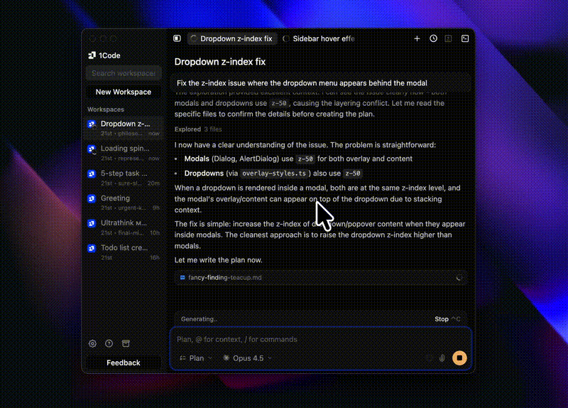

# 1Code

[1Code.dev](https://1code.dev)

Best UI for Claude Code with local and remote agent execution.

By [21st.dev](https://21st.dev) team

> **Platforms:** macOS, Linux, and Windows. Windows support improved thanks to community contributions from [@jesus-mgtc](https://github.com/jesus-mgtc) and [@evgyur](https://github.com/evgyur).

## 1Code vs Claude Code

| Feature | 1Code | Claude Code |
|---------|-------|-------------|
| **Visual UI** | ✅ Cursor-like desktop app | ✅ |
| **Git Worktree Isolation** | ✅ Each chat runs in isolated worktree | ✅ |
| **Background Execution** | ✅ Run multiple agents in parallel | ✅ |
| **Built-in Git Client** | ✅ Visual staging, commits, branches | ❌ CLI git commands only |
| **Integrated Terminal** | ✅ | ❌ |
| **Plan Mode** | ✅ | ✅ |
| **MCP Support** | ✅ | ✅ |
| **Memory (CLAUDE.md)** | ✅ | ✅ |
| **Skills & Slash Commands** | ✅ | ✅ |
| **Custom Subagents** | ✅ | ✅ |
| **Subscription & API Key Support** | ✅ | ✅ |
| **Custom Models & Providers (BYOK)** | ✅ | ✅ |
| **Voice Input** | ✅ Hold-to-talk dictation | ❌ |
| **Checkpointing** | 🚧 Beta | ✅ |
| **Tool Approve** | 📋 Backlog | ✅ |
| **Hooks** | ❌ | ✅ |

## Features

### Run Claude agents the right way

Run agents locally, in worktrees, in background — without touching main branch.


- **Git Worktree Isolation** - Each chat session runs in its own isolated worktree
- **Background Execution** - Run agents in background while you continue working
- **Local-first** - All code stays on your machine, no cloud sync required
- **Branch Safety** - Never accidentally commit to main branch

---

### UI that finally respects your code

Cursor-like UI for Claude Code with diff previews, built-in git client, and the ability to see changes before they land.


- **Diff Previews** - See exactly what changes Claude is making in real-time
- **Built-in Git Client** - Stage, commit, and manage branches without leaving the app
- **Change Tracking** - Visual diffs and PR management
- **Real-time Tool Execution** - See bash commands, file edits, and web searches as they happen

---

### Plan mode that actually helps you think

Claude asks clarifying questions, builds structured plans, and shows clean markdown preview — all before execution.



- **Clarifying Questions** - Claude asks what it needs to know before starting
- **Structured Plans** - See step-by-step breakdown of what will happen
- **Clean Markdown Preview** - Review plans in readable format
- **Review Before Execution** - Approve or modify the plan before Claude acts

---

### More Features

- **Plan & Agent Modes** - Read-only analysis or full code execution permissions
- **Project Management** - Link local folders with automatic Git remote detection
- **Integrated Terminal** - Full terminal access within the app

## 🔌 Plugin System (Experimental)

1Code includes an experimental plugin architecture that allows extending functionality
without modifying core code.

Plugins can:
- Register custom commands
- Hook into application lifecycle
- Enable future extensions like linters, formatters, and AI tools

See `src/shared/plugins/samplePlugin.ts` for a minimal example.


## Installation

### Option 1: Build from source (free)

```bash
# Prerequisites: Bun, Python, Xcode Command Line Tools (macOS)
bun install
bun run claude:download  # Download Claude binary (required!)
bun run build
bun run package:mac  # or package:win, package:linux
```

> **Important:** The `claude:download` step downloads the Claude CLI binary which is required for the agent chat to work. If you skip this step, the app will build but agent functionality won't work.

### Option 2: Subscribe to 1code.dev (recommended)

Get pre-built releases + background agents support by subscribing at [1code.dev](https://1code.dev).

Your subscription helps us maintain and improve 1Code.

## Development

```bash
bun install
bun run claude:download  # First time only
bun run dev
```

## Codespaces & Linux Notes

When running the Electron app inside **GitHub Codespaces**, Docker containers,
or minimal Linux environments, the UI may fail to launch due to the absence of
an X11 display server.

This is expected behavior and does **not** block development or builds.

If you encounter dependency resolution issues, use:

```bash
npm install --legacy-peer-deps
```

On Linux, Electron may require additional system libraries:

```bash
sudo apt-get install -y libatk1.0-0 libgtk-3-0 libnss3 libxss1 libasound2
```

You can still validate your changes by running:

```bash
npm run build
```

## Feedback & Community

Join our [Discord](https://discord.gg/8ektTZGnj4) for support and discussions.

## License

Apache License 2.0 - see [LICENSE](LICENSE) for details.
