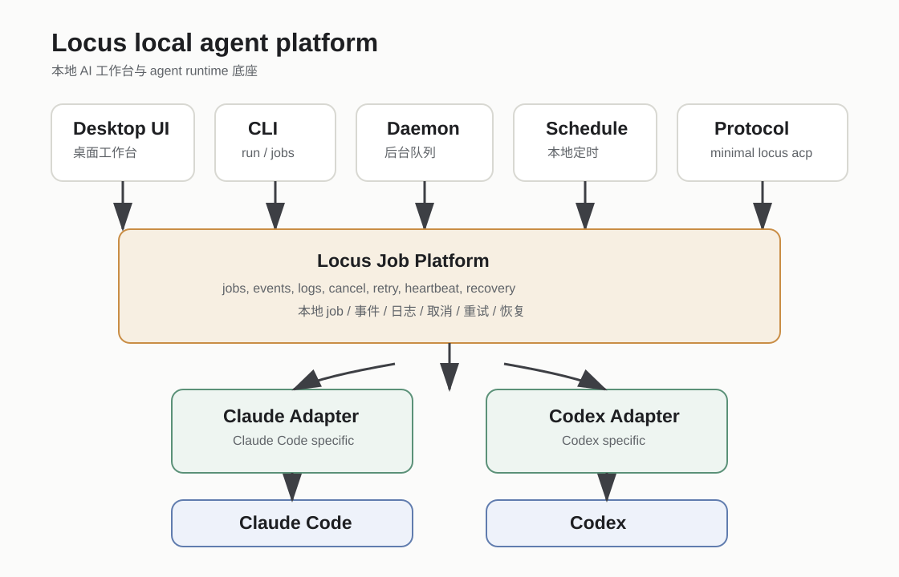
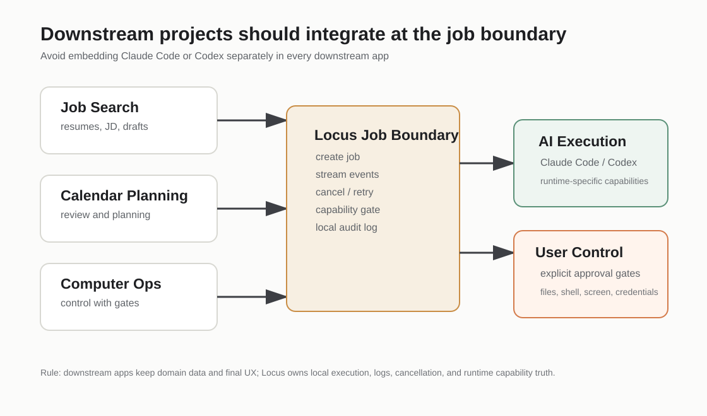

# Locus as a Local AI Workbench

Languages: English | [Simplified Chinese](locus-local-agent-platform.zh-CN.md)

Locus is moving from a coding-only desktop app toward a local-first AI
workbench for operating on local projects with multiple agent runtimes. It is a
user-facing workspace first, with an agent runtime hub underneath it.



## Positioning

Locus should own the local workbench experience and the runtime layer behind it:

- local project, worktree, file, terminal, and git workspace surfaces
- agent interaction flows for Claude Code, Codex, custom providers, MCP, and skills
- visible file edits, shell commands, git operations, tool use, approvals, and cancellation
- runtime setup and capability truth for each supported agent runtime
- local execution history, event logs, retry, recovery, and auditability
- headless CLI, daemon, schedules, and protocol entry points for automation and integrations
- safety boundaries for provider credentials, MCP, filesystem access, and future computer-control tools

Coding is still the first strong workflow, but it is not the only long-term
workflow. Other local-first tools can integrate with Locus, but the core product
is still the desktop workbench where users operate on local projects directly.

## Current Usable Surfaces

These surfaces exist today and are the safest integration points for nearby
projects:

| Surface | Use it for | Status |
| --- | --- | --- |
| Desktop Workbench | Inspect and control local jobs from the UI | Implemented |
| `locus run` | One-shot local tasks | Implemented; macOS smoked |
| `locus jobs` | List, show, logs, cancel, retry | Implemented; macOS smoked |
| `locus run --daemon` | Submit queued background work | Implemented; macOS smoked |
| `locus daemon run` | Claim daemon and schedule jobs | Implemented; macOS smoked |
| `locus schedules` | Create, pause, resume, delete, and run local schedules | Implemented; macOS smoked |
| `locus api` | Machine-readable Local Job API v1 for downstream consumers | Implemented; macOS smoked |
| `locus acp` | Minimal stdio protocol for job-backed runs | Experimental |

Windows source and shim behavior are covered by tests, but packaged Windows
real-machine smoke is still pending. Do not describe this platform as
cross-platform accepted until that evidence exists.

## Safety and Privacy Boundaries

Local-first means Locus stores jobs, event logs, settings, and project state
locally by default. It does not mean offline-only. Prompts, selected file
content, diffs, audio, tool context, or metadata may still be sent to the
user-selected runtime, provider, MCP server, or GitHub workflow.

Locus is not an OS sandbox. Terminal, git, filesystem, MCP, runtime tools, and
future computer-control flows can affect the local machine when authorized or
invoked. Describe supported safeguards as project/worktree-aware controls, not
as complete filesystem isolation.

Provider credentials should be resolved in the main process and renderer APIs
should receive only IDs, status, and redacted metadata. Job payloads, event
logs, ACP requests, and downstream integration payloads must not carry provider
secrets. Current exception: voice OpenAI key storage still needs hardening before
Locus can claim all API keys are encrypted in main-process secure storage.

## Recommended Integration Model

Downstream projects should call Locus at the work or job boundary instead of
embedding Claude Code or Codex CLIs directly.



Recommended shape:

```text
Downstream app
  -> Locus workbench, CLI, or future local protocol/API
  -> Locus runtime and local execution history
  -> AgentRuntime adapter
  -> Claude Code / Codex / provider runtime
```

The downstream app should own its domain state and final user-facing workflow.
Locus should own execution, logs, runtime capability checks, cancellation,
background queueing, and local auditability.

## Example Downstream Projects

These are intended integration patterns, not claims that all integrations are
already implemented.

### Local Job Search Assistant

A job-search app can keep resumes, cover letters, decisions, and submitted
artifacts in its own local workspace while using Locus to run review and draft
jobs.

Good first integration:

```text
visible job page / local package
  -> create Locus job
  -> stream job events
  -> write reviewed draft only after user confirmation
```

### Calendar and Planning Assistant

A calendar/planning tool can use daemon-backed schedules for recurring review
or planning jobs, but should default to plan/review mode and require explicit
approval before mutating calendar data.

Good first integration:

```text
local schedule
  -> queued Locus job
  -> plan or review output
  -> explicit user approval
  -> downstream app writes calendar changes
```

### Computer Operation Workbench

A computer-operation project can use Locus as the runtime/job layer, but it
must treat screen control, filesystem mutation, shell commands, and credentials
as separate high-risk capability gates.

Good first integration:

```text
external control app
  -> Locus job with declared capability needs
  -> explicit user-visible permission gates
  -> event log and cancel path stay in Locus
```

## What Locus Should Not Claim Yet

Do not claim these as implemented:

- full ACP compatibility
- hosted cloud agents
- hosted or OS-level scheduling
- full Claude Code and Codex behavior parity
- generic safe retry for desktop chat jobs
- automatic computer control without explicit permission gates
- a security sandbox for arbitrary plugin or runtime code
- cross-platform packaged acceptance before Windows real-machine smoke
- offline-only or fully private execution
- complete filesystem isolation
- all API keys encrypted in main-process secure storage while the voice-key
  hardening gap remains

## Protocol Strategy

The current `locus acp` surface is intentionally small. It proves that external
stdio requests can create local jobs, stream job events, cancel jobs, and shut
down without corrupting structured stdout.

It is not a full ACP server yet. Full ACP parity should be a separate project
with explicit protocol, session, permission, MCP, reconnect, and compatibility
tests.

The recommended downstream platform boundary is now the Locus-owned Local Job
API v1. ACP can then become one adapter over that stable local API rather than
the only platform interface.

## Local Job API v1

Local Job API v1 is implemented as the `locus api` CLI group. Downstream
projects should read the consumer guide rather than the OpenSpec proposal:

- [Local Job API v1 Consumer Guide](local-job-api-v1-consumer-guide.md)
- [Local Job API v1 Consumer Guide, Simplified Chinese](local-job-api-v1-consumer-guide.zh-CN.md)

Minimum useful operations:

- create a job with runtime, mode, cwd, prompt, source, and optional project link
- read job status
- stream events after a sequence number
- cancel a job
- retry a retryable job
- list runtime capabilities
- reject unsupported capabilities before runtime work starts
- keep stdout/stdin protocol modes machine-readable
- keep provider secrets out of request payloads, event logs, and renderer data

## Roadmap

Recommended order:

1. Finish Windows packaged real-machine smoke for `run`, `jobs`, daemon,
   schedules, ACP, exit codes, stdout/stderr, and Workbench visibility.
2. Harden documentation and release wording so local macOS completion is not
   confused with cross-platform release readiness.
3. Keep the Local Job API v1 consumer guide aligned with implementation and
   smoke evidence.
4. Let downstream projects integrate through the job boundary.
5. Add stronger capability and permission gates for non-coding domains.
6. Add full ACP parity only when a real external client needs standard ACP
   session/protocol behavior.
7. Add hosted or OS-level scheduling only after the local daemon and job
   recovery model are stable on both macOS and Windows.

## Documentation Rule

Public wording should describe implemented evidence, not aspiration.

Use:

```text
local-first AI workbench
local job platform
runtime hub for Claude Code and Codex powered work
minimal ACP stdio job surface
macOS local smoke complete; Windows real-machine smoke pending
```

Avoid:

```text
complete ACP server
universal automation platform
fully cross-platform accepted
secure sandbox for arbitrary extensions
offline-only
fully private
all API keys encrypted
complete filesystem isolation
Claude and Codex parity
cloud agent platform
```
