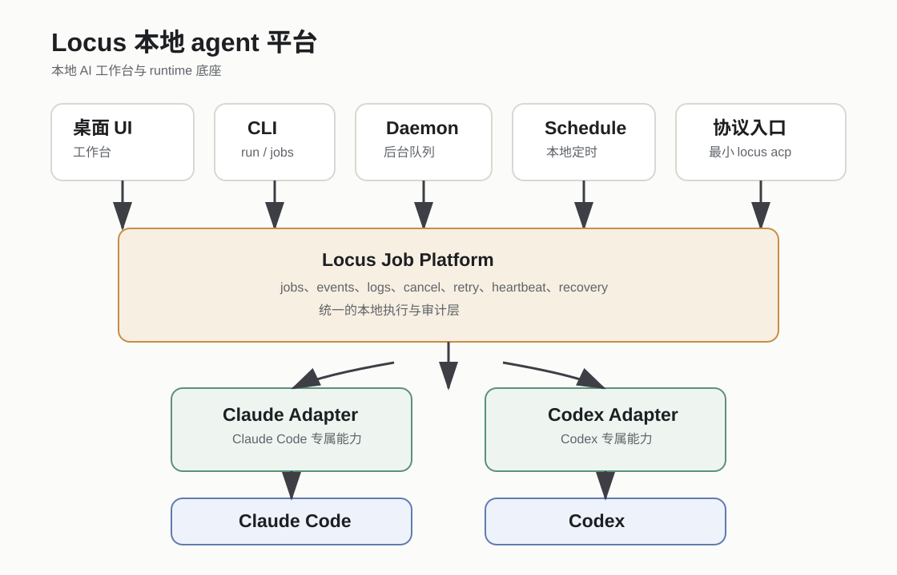
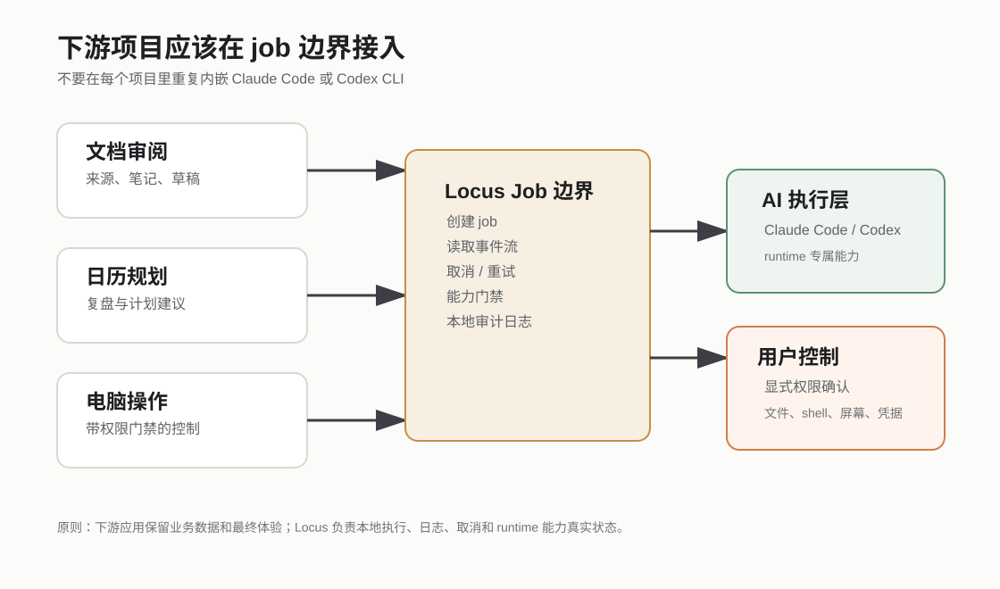

# Locus 作为本地 Agent 平台

语言：[English](locus-local-agent-platform.md) | 简体中文

Locus 正在从单一 coding 桌面应用，演进为本地优先的 AI 工作台和 agent runtime 底座。



## 定位

Locus 应该负责本地 runtime 层：

- Claude Code / Codex 的 runtime 配置和能力真实状态
- 本地 job 创建、事件日志、取消、重试和恢复
- 桌面可见性和用户控制
- headless CLI 入口
- daemon 驱动的后台任务
- 用户显式创建的本地 schedule
- 给外部 client 使用的窄协议入口

coding 仍然是第一个强场景，但不是长期唯一场景。其他本地优先工具可以把 Locus
作为运行、追踪、观察和控制 AI 任务的底座。

## 当前可用入口

这些入口目前已经存在，也是周边项目最适合依赖的集成点：

| 入口 | 用途 | 状态 |
| --- | --- | --- |
| Desktop Workbench | 在 UI 里查看和控制本地 job | 已实现 |
| `locus run` | 一次性本地任务 | 已实现，macOS 已 smoke |
| `locus jobs` | list/show/logs/cancel/retry | 已实现，macOS 已 smoke |
| `locus run --daemon` | 提交后台队列任务 | 已实现，macOS 已 smoke |
| `locus daemon run` | 消费 daemon 和 schedule job | 已实现，macOS 已 smoke |
| `locus schedules` | 创建、暂停、恢复、删除、立即运行本地 schedule | 已实现，macOS 已 smoke |
| `locus acp` | job-backed run 的最小 stdio 协议入口 | 实验性 |

Windows 源码和 shim 行为有测试覆盖，但 Windows packaged 实机 smoke 仍未完成。在
这项证据完成前，不要把该平台描述成已经完成双平台验收。

## 安全和隐私边界

本地优先表示 Locus 默认把 jobs、event logs、settings 和 project state 存在本地。它不
等于 offline-only。prompt、选中的文件内容、diff、音频、tool context 或 metadata 仍
可能发送到用户选择的 runtime、provider、MCP server 或 GitHub workflow。

Locus 不是 OS sandbox。terminal、git、filesystem、MCP、runtime tools，以及未来的
computer-control flows，在用户授权或调用后都可能影响本机。文档里应该把已支持的防护
描述成 project/worktree-aware controls，而不是完整文件系统隔离。

provider credentials 应该在 main process 解析，renderer API 只应该拿到 ID、状态和脱敏
metadata。job payload、event logs、ACP requests 和下游集成 payload 都不应该携带
provider secrets。当前例外：voice OpenAI key storage 仍需要硬化；在完成前，不能宣称
所有 API key 都已进入 main-process secure storage。

## 推荐集成方式

下游项目应该在 job 边界调用 Locus，而不是各自内嵌 Claude Code 或 Codex CLI。



推荐结构：

```text
下游应用
  -> Locus CLI 或未来 Local Job API
  -> Locus Job Platform
  -> AgentRuntime adapter
  -> Claude Code / Codex
```

下游应用应该拥有自己的业务状态和最终用户流程。Locus 应该负责执行、日志、runtime
能力检查、取消、后台队列和本地审计。

## 下游项目示例

这些是推荐的集成模式，不代表所有集成都已经完成。

### 本地求职助手

求职应用可以自己保存简历、cover letter、决策记录和最终提交材料，同时把审阅和草稿
生成任务交给 Locus 执行。

第一阶段适合集成：

```text
当前职位页 / 本地材料包
  -> 创建 Locus job
  -> 读取 job events
  -> 用户确认后再写入草稿或 final artifact
```

### 日历和规划助手

日历/规划工具可以用 daemon-backed schedule 做定期审阅或计划任务，但默认应该使用
plan/review 模式，修改日历数据前必须显式确认。

第一阶段适合集成：

```text
本地 schedule
  -> queued Locus job
  -> plan/review 输出
  -> 用户显式批准
  -> 下游应用写入日历变更
```

### 电脑操作工作台

电脑操作类项目可以把 Locus 作为 runtime/job 层，但屏幕控制、文件修改、shell 命令和
凭据必须作为独立的高风险能力门禁处理。

第一阶段适合集成：

```text
外部电脑控制应用
  -> 创建带能力声明的 Locus job
  -> 用户可见的权限确认
  -> 日志和取消路径仍由 Locus 管理
```

## Locus 暂时不应该宣称什么

不要宣称这些已经实现：

- 完整 ACP 兼容
- hosted/cloud agents
- hosted 或 OS-level scheduling
- Claude Code 和 Codex 完整行为一致
- 普通桌面聊天 job 的通用安全 retry
- 无显式授权门禁的自动电脑控制
- 任意 plugin/runtime code 的安全沙箱
- Windows 实机 smoke 前的双平台 packaged 验收完成
- offline-only 或完全隐私执行
- 完整文件系统隔离
- voice-key hardening gap 完成前的“所有 API key 都已加密并进入 main-process secure storage”

## 协议策略

当前 `locus acp` 是刻意收窄的入口。它证明外部 stdio 请求可以创建本地 job、流式返回
job events、取消 job，并且在 shutdown 时保持 stdout 结构化。

它还不是完整 ACP server。完整 ACP parity 应该作为单独项目处理，并明确协议、session、
permission、MCP、reconnect 和兼容性测试。

更推荐的下一步平台边界是 Locus 自己拥有的 Local Job API v1。ACP 可以成为这个稳定
本地 API 之上的一个 adapter，而不是唯一平台接口。

## Local Job API v1 方向

这是未来方向，不是已经实现的 API contract。

最小可用能力：

- 用 runtime、mode、cwd、prompt、source 和可选 project link 创建 job
- 读取 job 状态
- 按 sequence 增量读取 events
- 取消 job
- 重试可重试 job
- 列出 runtime capabilities
- 在 runtime 执行前拒绝不支持的能力
- 结构化协议模式保持 stdout/stdin 可机器解析
- provider secrets 不进入请求 payload、event logs 和 renderer data

## 路线图

推荐顺序：

1. 完成 Windows packaged 实机 smoke，覆盖 `run`、`jobs`、daemon、schedules、
   ACP、exit code、stdout/stderr 和 Workbench 可见性。
2. 收紧文档和 release wording，避免把 macOS 本地完成误写成双平台 release-ready。
3. 用 OpenSpec 定义 Local Job API v1。
4. 让下游项目先通过 job 边界接入。
5. 为非 coding 场景补强 capability 和 permission gates。
6. 只有真实外部 client 需要标准 ACP session/protocol 行为时，再做 full ACP parity。
7. 只有本地 daemon 和 job recovery 在 macOS/Windows 都稳定后，再做 hosted 或
   OS-level scheduling。

## 文档规则

公开文案必须描述已有证据，而不是愿景本身。

可以使用：

```text
local-first AI workbench
local job platform
runtime hub for Claude Code and Codex powered work
minimal ACP stdio job surface
macOS local smoke complete; Windows real-machine smoke pending
```

避免使用：

```text
complete ACP server
universal automation platform
fully cross-platform accepted
secure sandbox for arbitrary extensions
offline-only
fully private
all API keys encrypted
complete filesystem isolation
Claude and Codex parity
cloud agent platform
```
